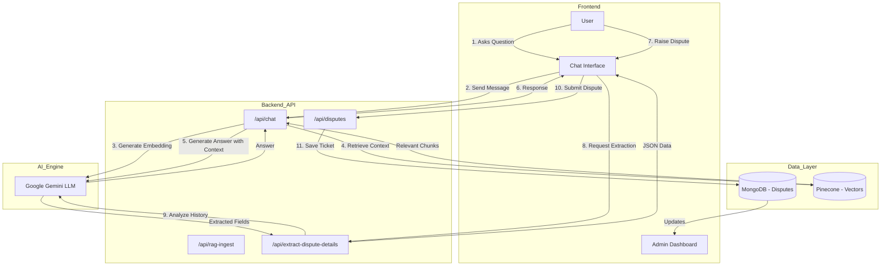

# Dispute Triage & Resolution System


## 🚀 Project Overview
This project is an intelligent **Dispute Triage and Resolution System** designed to streamline the customer support process for banking and financial services. It leverages **Generative AI (Google Gemini)** and **RAG (Retrieval-Augmented Generation)** to provide instant, accurate answers to customer queries and automate the dispute logging process.

# Note: This project is assuming access to only authorized company employee and user based on certain specific authentication(RBAC of any company like IAM  group in AWS)


## ❓ The Problem
*   **High Volume**: Support teams are overwhelmed with repetitive queries.
*   **Slow Response**: Manual triage and data entry lead to delayed resolution times.
*   **Inconsistency**: Human agents may provide varying answers to the same policy questions.
*   **Manual Effort**: Extracting dispute details and logging tickets is time-consuming.

## 💡 The Solution

* **Please read Solution.md file for more details about the solution strategy**
Implemented a **Next.js** web application that combines a customer-facing AI chatbot with an admin dashboard.
*   **AI Chatbot**: Uses RAG to answer policy questions instantly using uploaded documents and create dispute tickets automatically by taking data from the conversation.
*   **Automated Triage**: If the user is unhappy, the AI extracts dispute details (Amount, Category, Priority) from the chat history and pre-fills a dispute form.
*   **Admin Dashboard**: A centralized view for agents to manage, filter, and resolve disputes.

## Future Enhancements
*   **Slack Integration**: SLA breached cases will be sent to the Slack channel.
*   **Reporting & Analytics Dashboard**: To provide insights into dispute volume, resolution times, and agent performance trends.
*   **Integration with CRM/Core Banking Systems**: For seamless data flow and real-time dispute status updates.


## 🛠️ Tech Stack
*   **Frontend & Backend**: [Next.js 15](https://nextjs.org/) (React, TypeScript)
*   **Database**: [MongoDB](https://www.mongodb.com/) (Mongoose)
*   **AI & LLM**: [Google Gemini API](https://ai.google.dev/) (`gemini-2.0-flash`, `text-embedding-004`)
*   **Vector Database**: [Pinecone](https://www.pinecone.io/) (for RAG context retrieval)
*   **Styling**: Tailwind CSS
*   **PDF Parsing**: `pdf2json`

## 🧠 Approach & RAG Implementation

### Why RAG (Retrieval-Augmented Generation)?
Standard LLMs can hallucinate or lack specific knowledge about your private policies. RAG solves this by:
1.  **Ingesting** your policy documents (PDF/TXT) into a Vector Database (Pinecone).
2.  **Retrieving** the most relevant text chunks when a user asks a question.
3.  **Augmenting** the LLM prompt with this context to generate a factual answer.

**Benefits:**
*   **Reduced Manual Intervention**: The bot handles L1/L2 queries automatically.
*   **Scalability**: Can be trained on any team's data by simply uploading new documents.
*   **Accuracy**: Answers are grounded in your actual policy documents.

### Workflow Architecture


### Sequence + System Interaction Diagram


## 📂 File Structure

```
├── src/
│   ├── app/
│   │   ├── api/                # Backend API Routes
│   │   │   ├── chat/           # Chatbot logic (RAG + Gemini)
│   │   │   ├── disputes/       # CRUD for Disputes
│   │   │   ├── extract-dispute-details/ # AI Extraction logic
│   │   │   └── rag-ingest/     # Document ingestion (PDF/TXT)
│   │   ├── chatbot/            # Customer Chat Interface
│   │   └── dashboard/          # Admin Dashboard & Knowledge Base
│   ├── components/             # Reusable UI components
│   ├── lib/                    # Utilities (DB connection)
│   └── models/                 # Mongoose Schemas (Dispute.ts)
└── README.md                   # Project documentation
```
 
## Working
 * **Step1**: Bank official will upload the dispute realted documents (PDF/TXT) in the knowledge base section.
 * **Step2**:Bank offical will upload the dispute excel file in the dashboard and on uploadin the dispute will be sorted based on the priority,stage and amount according to my solution logic.
 * **Step3**:SLA breached cases will be shown in the dashboard as a alert at the top.
 * **Step4**: User will ask the dispute related questions in the chat interface.
 * **Step5**: Chatbot will answer the questions using RAG and provide the answer.
 * **Step6**: If the user is unhappy, the chatbot will extract the dispute details (Amount, Category, Priority) from the chat history and pre-fill a dispute form.
 * **Step7**: User will submit the dispute form and the dispute will be created in the database.
 * **Step8**: Admin will view the dispute in the admin dashboard and can resolve the dispute.

## Deployed link (Chatbot may not work if gemini api limit exhaust)
 Live Demo : [Dispute_Triage](https://dispute-triage-hdfc-capstone-projec.vercel.app)

## 🚀 Getting Started

1.  **Clone the repository**.
2.  **Install dependencies**:
    ```bash
    npm install
    ```
3.  **Configure Environment Variables** (`.env.local`):
    ```env
    MONGODB_URI=your_mongodb_uri
    GEMINI_API_KEY=your_gemini_key
    PINECONE_API_KEY=your_pinecone_key
    PINECONE_INDEX_NAME=your_index_name
    ```
4.  **Run the application**:
    ```bash
    npm run dev
    ```
5.  **Access the App**:
    *   **Web App**: `http://localhost:3000`
